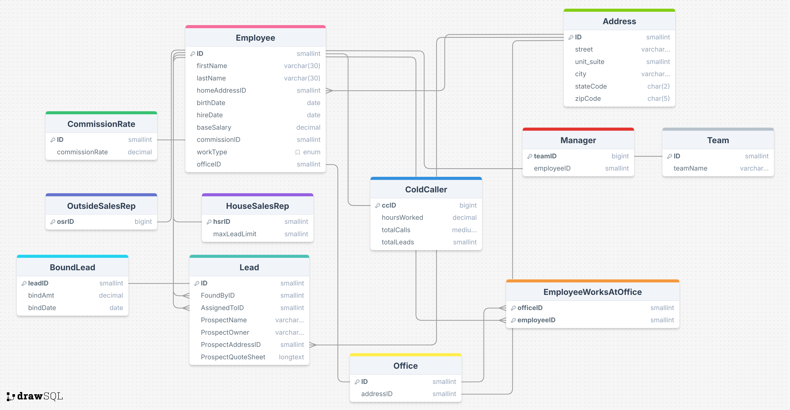

# Commercial Auto Insurance Brokerage

My chosen project models data in tracking the different types of employees, their commissions, leads they are associated in finding, working, and binding, and the offices they work under.





## Well-Performed Query:
"question": "What is a cold caller's lead conversion per hour ratio?",
      "sql": "SELECT e.firstName, e.lastName, \n       (cc.totalLeads / cc.hoursWorked) AS leadConversionPerHour\nFROM ColdCaller cc\nJOIN Employee e ON cc.ID = e.ID;",
      "queryRawResponse": "[('Bob', 'Jones', 0.5633802816901409), ('Eva', 'Brown', 0.75)]",
      "friendlyResponse": "Based on the query results, the cold caller lead conversion per hour ratio is as follows:\n\n- Bob Jones has a lead conversion rate of approximately 0.56 leads per hour.\n- Eva Brown has a lead conversion rate of 0.75 leads per hour.\n\nThese figures represent the number of leads each cold caller converts, on average, for every hour worked.",
      "error": "None"

**Question**: "What is a cold caller's lead conversion per hour ratio?"

**GPT SQL Response**:
```sql
SELECT e.firstName, e.lastName, (cc.totalLeads / cc.hoursWorked) AS leadConversionPerHour
FROM ColdCaller cc
JOIN Employee e ON cc.ID = e.ID;
```

**Friendly Response**: "Based on the query results, the cold caller lead conversion per hour ratio is as follows:\n\n- Bob Jones has a lead conversion rate of approximately 0.56 leads per hour.\n- Eva Brown has a lead conversion rate of 0.75 leads per hour.\n\nThese figures represent the number of leads each cold caller converts, on average, for every hour worked."


## Query It Struggled With:
It seemingly performed the desired task in drawing up the SQL query for this question, but it disregarded my specific request it use names to describe any person entities and did just the bare minimum, which was returning IDs fro the employees working at each office rather than their names and making that JOIN happen to do so. That is a fairly natural follow-up thought/question that it did not make an effort to answer.

"question": "How many employees work at each office?",
      "sql": "SELECT o.ID AS officeID, COUNT(e.ID) AS employeeCount\nFROM Office o\nJOIN EmployeeWorksAtOffice ewo ON o.ID = ewo.officeID\nJOIN Employee e ON ewo.employeeID = e.ID\nGROUP BY o.ID;",
      "queryRawResponse": "[(1, 2), (2, 3)]",
      "friendlyResponse": "The query result indicates that the number of employees working at each office is as follows:\n\n- Office 1 has 2 employees.\n- Office 2 has 3 employees.\n\nUnfortunately, the results data only provides office IDs and employee counts; it does not include names. To describe employees by name, you would need to query additional information from the `Employee` table to map employee IDs to names.",
      "error": "None"

Question: "How many employees work at each office?"

**GPT SQL Response**:
```sql
SELECT o.ID AS officeID, COUNT(e.ID) AS employeeCount
FROM Office o
JOIN EmployeeWorksAtOffice ewo ON o.ID = ewo.officeID
JOIN Employee e ON ewo.employeeID = e.ID
GROUP BY o.ID;
```

SQL Result is only the "IDs" with a nameless count: "[(1, 2), (2, 3)]"

**Friendly response**: "The query result indicates that the number of employees working at each office is as follows:\n\n- Office 1 has 2 employees.\n- Office 2 has 3 employees.\n\nUnfortunately, the results data only provides office IDs and employee counts; it does not include names. To describe employees by name, you would need to query additional information from the `Employee` table to map employee IDs to names."


## Multi-shot vs Zero-shot:
- The multi-shot strategy prompt initially confused the model on the first question, as it did not interpret the sample question and expected response type/format as context, but rather a question to be answered, which confused it when the real question came. Also, in giving it more specific prompts to try and avoid having IDs be returned when names are available, it made the AI a little more verbose in explaining why it did not achieve that goal.
- Both zero-shot and multi-shot would need greater specificity in how to respond as if there was no intermediate translation between NQL and SQL, as many of the prompts began with *"Certainly!"* or *"Based on the query results"*, which is unnecessary to the user.
- Aside from the shared random SQL prompt cleaning syntax errors, it seemed that the zero-shot was a little bit of a stronger/cleaner strategy.


## Conclusion
You can rely upon ChatGPT-4o to generate SQL queries given the schema very fluidly, but its strength is dependent upon how well constructed your schema is. I initially had the subentities for each type of staff at the brokerage have a primary/foreign key named specifically, like 'osrID' instead of just 'ID,' which was not intuitive to the LLM in trends and standard practices, so it made false assumptions. Once I changed that, my database fell in line with "the standard" and it had no trouble drawing up the queries.
